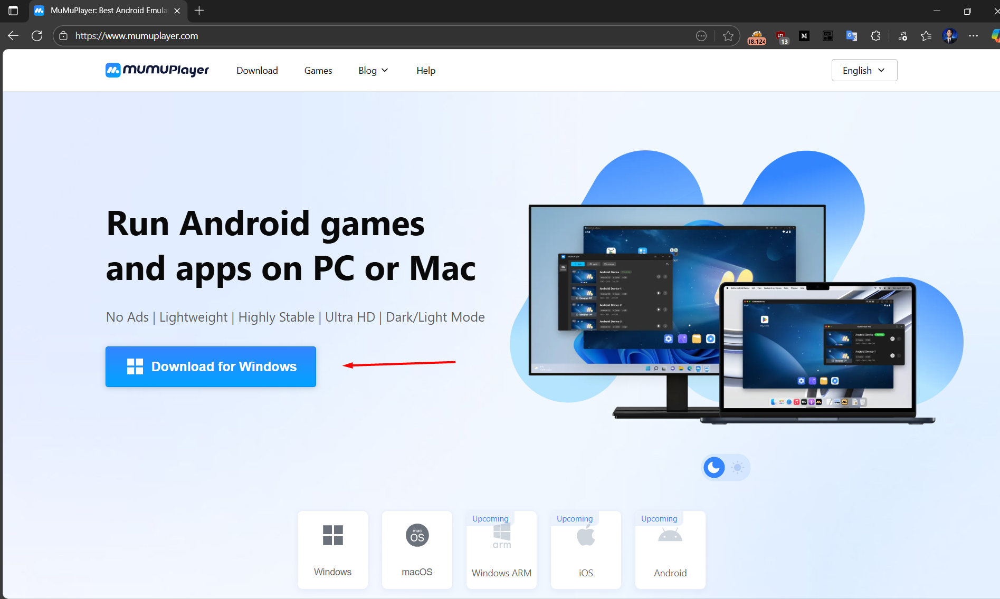

# Cài đặt môi trường

## Bước 1: Cài đặt máy ảo

 Để thực hiện kiểm thử hệ thống bảo mật trên thiết bị di động **Android** trước hết ta sẽ cài đặt máy ảo ở đây mình sử dụng **MuMuPlayer** các bạn có thể sử dụng các phần mềm tương tự như **Ldplayer**, **Nox**, **Genymotion**,... có rất nhiều cái này tùy thích.

Truy cập đường dẫn: [https://www.mumuplayer.com](https://www.mumuplayer.com/) và bấm tải về máy tính 



chạy cài đặt là ta đã hoàn thành bước số 1 rồi :3 .

## Bước 2: Cài đặt các APP liên quan phục vụ công việc (Còn update)

Để thực hiện pentest ta cần các app trên ( Tối thiểu vì thật sử cần nhiều hơn nhưng tôi chưa có đụng đến (∩｀-´)⊃━☆ﾟ.*･｡ ) cách dùng chúng tôi sẽ nói ở phần sau nhé 🤣🤣🤣

### Phần mềm Root Certificate Manager

!!! question "Tại sao lại phải cài đặt app này ?" 

    Phần mềm này cho phép cài đặt certificates vào máy điện thoại ảo vì từ **Android 9** trở lên ta không thể cài đặt certificates với người dùng user thông thường.

Truy cập đường dẫn: [https://root-certificate-manager-root.en.softonic.com/android/download](https://root-certificate-manager-root.en.softonic.com/android/download)


Sau khi tải về ta kéo vào máy ảo là ta đã cài đặt thành công rồi !

### Phần mềm Drony

Ở trong các công ty lớn hoặc vừa policy network thường rất chặt chẽ vì vậy đôi khi nó sẽ cản trở việc mình capture request từ **burpsuite** vì thế nên ta nên cài đặt nó hoặc không :3 bạn có thể bị hardstuck mấy ngày giống tôi vì méo biết sao mình làm đủ thứ nhưng không capture được request nào 🙂‍↔️🙂‍↔️🙂‍↔️.

Truy cập đường dẫn: [https://drony.en.uptodown.com/android/download](https://drony.en.uptodown.com/android/download)


Sau khi tải về ta kéo vào máy ảo là ta đã cài đặt thành công rồi !

### Phần mềm Apk Extractor

Bạn đang không nhận được một file **.apk** mà nhận được app việc của bạn là cài đặt cái thằng này để lấy file apk về máy tính

## Bước 3: Xác định vị trí của ADB trên máy, Bật adb debug và làm quen câu lệnh cơ bản Pull, Push, Shell

```python 
Import Os
print ('Xin chúc mừng bạn đã hoàn thành phần đầu rùi hãy sang bài tiếp theo nhé ~~')
```